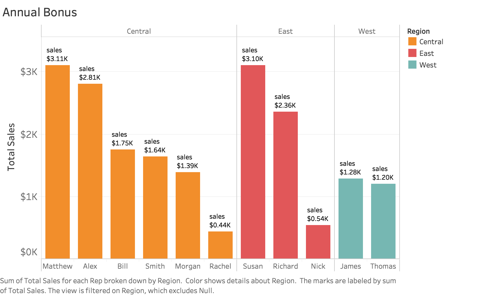
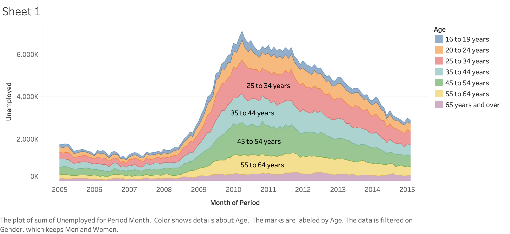
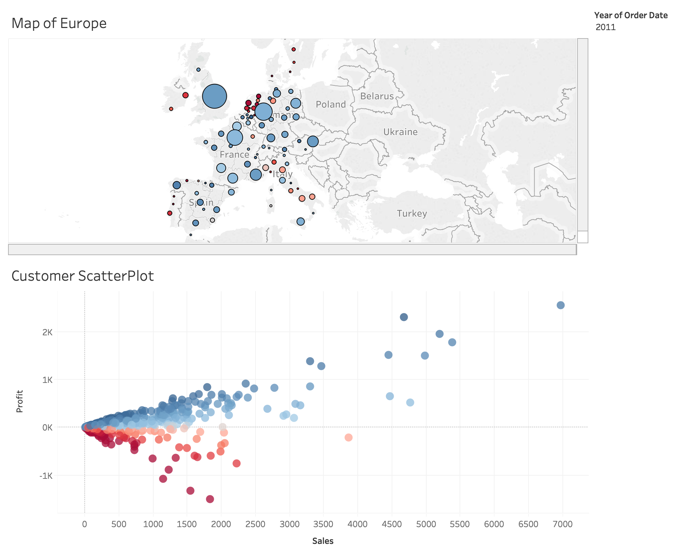
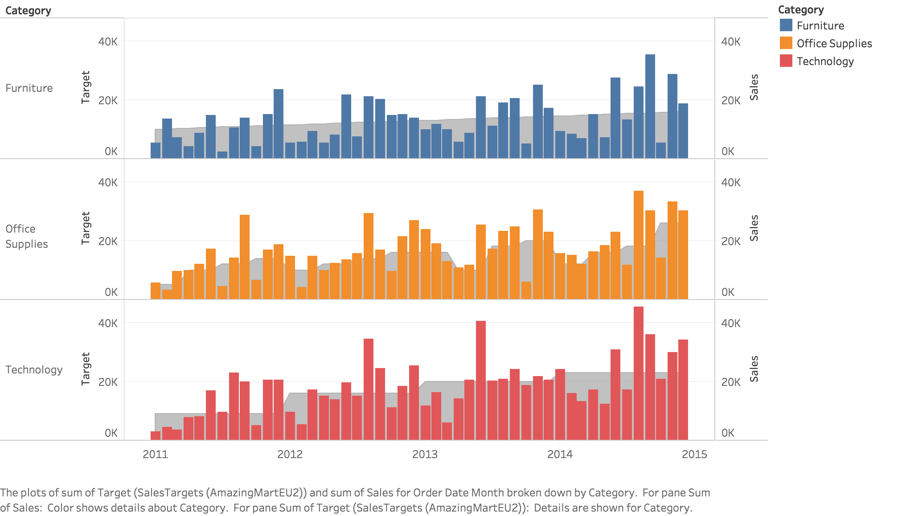
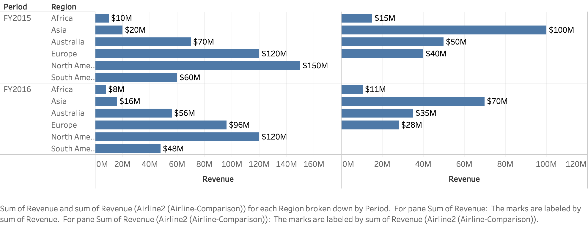

# Tableau-Analysis-Practice

Welcome to my practice git repository of Tableau. There are some results for practicing different plots

## Bar Chart for Bouns

## Area Chart for Age Group Through Time

## Map with ScatterPlot 

## Dual Axis Chart (Bar Plot with Area plot)

## Horizontal Bar Plot: Performances of Two Airlines by Regions

